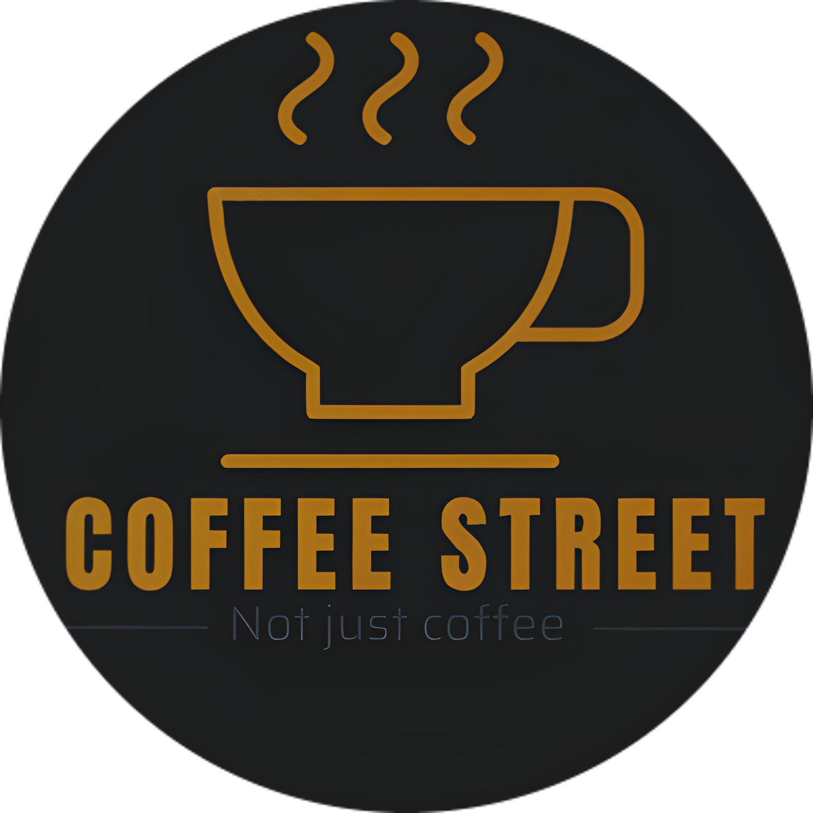

# CoffeeStreet-front-end

  

Es una aplicación de comercio electrónico en grado MVP. 

# Arrancar el proyecto de manera local

0. Para acceder a la data primero deberas descargar el repo <a href="https://github.com/MrBluegru/CoffeeStreet-BackEnd">CoffeeStreet-BackEnd</a> 

1. Instalar las dependencias, ejecuta el comando `npm install`

2. Clonar el archivo `.env.template` y renombrarlo a `.env`

3. Ejecutar el comando `npm start`

## Construido con:

1. ReactJS, Redux.

### Componentes
----------------------
| Componente            | Status  |
| --------------------- | :-----: |
| **START SPRINT 1**    | ******* |
| Landing               | active |
| About                 | active |
| Navbar                | active |
| Home                  | active |
| Menu                  | active |
| Products              | active |
| Search product        | active |
| Card Product          | active |
| Details Product       | active |
| News                  | active |
| Discounts             | active |
| Admin dashboard       | active |
| Add Products(Admin)   | active |
| **END SPRINT 1**      | ******* |
| **START SPRINT 2**    | ******* |
| Form New Client       | active |
| Sign Up               | active |
| Log In                | active |
| Profits(Admin)        | active |
| My account(Admin)     | active |
| Employee dashboard    | active |
| My account(Employee)  | active |
| Client dashboard      | active |
| My account(Client)    | active |
| Favoritos(clients)    | active |
| My Orders(clients)    | active |
| **END SPRINT 2**      | ******* |
| **START SPRINT 3**    | ******* |
| Edit Products(Admin)  | active |
| All Orders(Admin)     | active |
| All Users(Admin)      | active |
| Edit discounts(Admin) | active |
| Shopping cart         | active |
| payment market        | active |
| **END SPRINT 3**      | ******* |
----------------------
